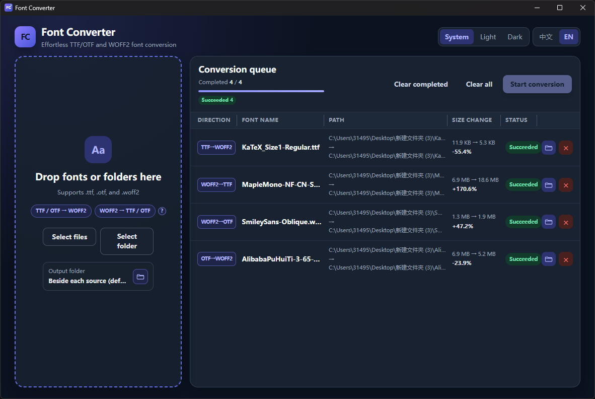
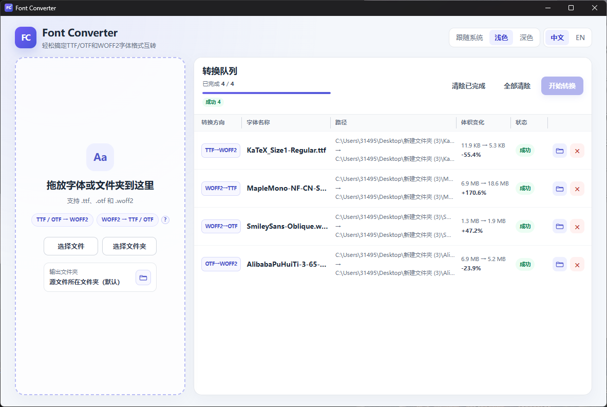

# Font Converter

Cross-platform desktop and command-line font conversion between TTF/OTF and WOFF2.

[English](#english) · [简体中文](#简体中文) · [Download](https://github.com/MDfox-ChaosZone/Font-Converter/releases/latest)

<p align="center">
  
  
</p>

## English

### Highlights

- Convert TTF/OTF to WOFF2 and decode WOFF2 back to its original TTF or OTF flavor.
- Process files or entire folders with drag-and-drop, selectable output locations, and adjustable parallelism (default: 4).
- Switch between English and Simplified Chinese, with light, dark, and system themes.
- Use either the Tauri desktop app or the script-friendly CLI on Windows, Linux, and macOS.
- Preserve source files by default; overwriting existing output requires explicit opt-in.

### Core codec and performance

Font Converter uses [Google WOFF2](https://github.com/google/woff2) as its core codec. Google WOFF2 handles the font container, table transforms, and TTF/OTF ↔ WOFF2 conversion; [Google Brotli](https://github.com/google/brotli) provides the compression layer.

The project replaces Google WOFF2's originally pinned Brotli `1.0.3` with Brotli `1.2.0`, the latest stable release when integrated. In project benchmarks, this upgrade improved TTF/OTF → WOFF2 conversion speed by approximately **10%**. Actual gains vary with the font, hardware, and workload.

Both dependencies are pinned as Git submodules for reproducible builds.

### Download

Download the desktop app or CLI from the [latest GitHub Release](https://github.com/MDfox-ChaosZone/Font-Converter/releases/latest).

Available artifacts include:

- Windows x64 and ARM64 portable desktop apps and CLI binaries
- Linux x86_64 and ARM64 AppImage, DEB, RPM, and CLI binaries
- macOS Apple Silicon DMG and CLI binaries

### CLI quick start

Download the CLI for your platform, or build it from source. A few common examples:

```bash
font-converter-cli ./fonts
font-converter-cli --mode encode -o ./converted ./fonts
font-converter-cli --mode decode --jobs 2 ./web-fonts
font-converter-cli --dry-run --json ./fonts
```

Useful options:

- `--mode <auto|encode|decode>` selects the conversion direction.
- `--output-dir <DIR>` writes results to that directory, creates it when needed, and preserves relative paths.
- `--existing <skip|error|overwrite>` controls existing outputs; the default is `skip`.
- `--jobs <N>` sets parallelism; `--dry-run` previews work; `--json` emits one machine-readable report.
- JSON reports include a `formatVersion` and stable `errorCode` values for automation.
- Run `font-converter-cli --help` for the complete, version-specific option list.

### Build from source

Requirements: Rust stable, Node.js 22.12 or newer with npm, Git, a platform C/C++ toolchain, and the GUI prerequisites for [Tauri 2](https://v2.tauri.app/start/prerequisites/).

```bash
git clone --recurse-submodules https://github.com/MDfox-ChaosZone/Font-Converter.git
cd Font-Converter

# CLI
cargo build -p font-converter-cli --release

# Desktop app
npm ci --prefix frontend
cargo install --locked tauri-cli
cargo tauri dev
```

If you cloned without submodules, run:

```bash
git submodule update --init --recursive
```

The release CLI is written to `target/release/font-converter-cli` (`.exe` on Windows).

### Project structure

- `core`: shared conversion engine and Google WOFF2/Brotli native build
- `cli`: command-line interface
- `frontend`: Vue 3 and TypeScript user interface built with Vite
- `src-tauri`: Tauri desktop shell
- `shared`: shared types and conversion workflow

### License

Font Converter is available under either the [MIT License](LICENSE-MIT) or [Apache License 2.0](LICENSE-APACHE), at your option. Third-party notices are listed in [NOTICE](NOTICE).

---

## 简体中文

Font Converter 是一款跨平台桌面与命令行字体转换工具，支持 TTF/OTF 与 WOFF2 双向转换。

### 主要特性

- 将 TTF/OTF 转为 WOFF2，并根据 WOFF2 中的原始 flavor 自动还原为 TTF 或 OTF。
- 支持文件和文件夹拖放、自定义输出位置，以及可调并行数（默认 4）。
- 支持简体中文与英文，以及浅色、深色和跟随系统主题。
- 同时提供 Windows、Linux、macOS 桌面应用与适合脚本调用的 CLI。
- 默认保留源文件；覆盖已有输出必须显式启用。

### 核心算法与性能

Font Converter 的核心编解码算法来自 [Google WOFF2](https://github.com/google/woff2)。Google WOFF2 负责字体容器、字体表变换以及 TTF/OTF ↔ WOFF2 转换；[Google Brotli](https://github.com/google/brotli) 提供压缩层。

本项目将 Google WOFF2 原先固定的 Brotli `1.0.3` 升级为集成时最新的稳定版 Brotli `1.2.0`。项目基准测试显示，升级后 TTF/OTF → WOFF2 转换速度提升约 **10%**；实际提升会随字体、硬件和任务类型而变化。

两个依赖均以 Git 子模块固定版本，确保构建可复现。

### 下载

请前往[最新 GitHub Release](https://github.com/MDfox-ChaosZone/Font-Converter/releases/latest)下载桌面应用或 CLI。

当前发布制品包括：

- Windows x64、ARM64 便携版桌面应用与 CLI
- Linux x86_64、ARM64 的 AppImage、DEB、RPM 与 CLI
- macOS Apple Silicon 的 DMG 与 CLI

### CLI 快速上手

下载对应平台的 CLI，或从源码构建。常用示例：

```bash
font-converter-cli ./fonts
font-converter-cli --mode encode -o ./converted ./fonts
font-converter-cli --mode decode --jobs 2 ./web-fonts
font-converter-cli --dry-run --json ./fonts
```

常用参数：

- `--mode <auto|encode|decode>` 选择转换方向。
- `--output-dir <DIR>` 输出到指定目录、按需自动创建，并保留相对路径。
- `--existing <skip|error|overwrite>` 控制已有文件；默认值为 `skip`。
- `--jobs <N>` 设置并行数；`--dry-run` 仅预览；`--json` 输出一份机器可读报告。
- JSON 报告包含 `formatVersion` 和稳定的 `errorCode`，便于自动化处理。
- 运行 `font-converter-cli --help` 查看当前版本的完整参数。

### 从源码构建

需要 Rust stable、Node.js 22.12 或更新版本及 npm、Git、平台对应的 C/C++ 工具链，以及 [Tauri 2](https://v2.tauri.app/start/prerequisites/) 的 GUI 构建依赖。

```bash
git clone --recurse-submodules https://github.com/MDfox-ChaosZone/Font-Converter.git
cd Font-Converter

# CLI
cargo build -p font-converter-cli --release

# 桌面应用
npm ci --prefix frontend
cargo install --locked tauri-cli
cargo tauri dev
```

如果克隆时没有初始化子模块，请运行：

```bash
git submodule update --init --recursive
```

Release 模式的 CLI 位于 `target/release/font-converter-cli`（Windows 为 `.exe`）。

### 项目结构

- `core`：共享转换引擎及 Google WOFF2/Brotli 原生构建
- `cli`：命令行界面
- `frontend`：使用 Vite 构建的 Vue 3 + TypeScript 用户界面
- `src-tauri`：Tauri 桌面外壳
- `shared`：共享类型与转换流程

### 许可证

Font Converter 可任选 [MIT License](LICENSE-MIT) 或 [Apache License 2.0](LICENSE-APACHE) 使用。第三方声明见 [NOTICE](NOTICE)。
